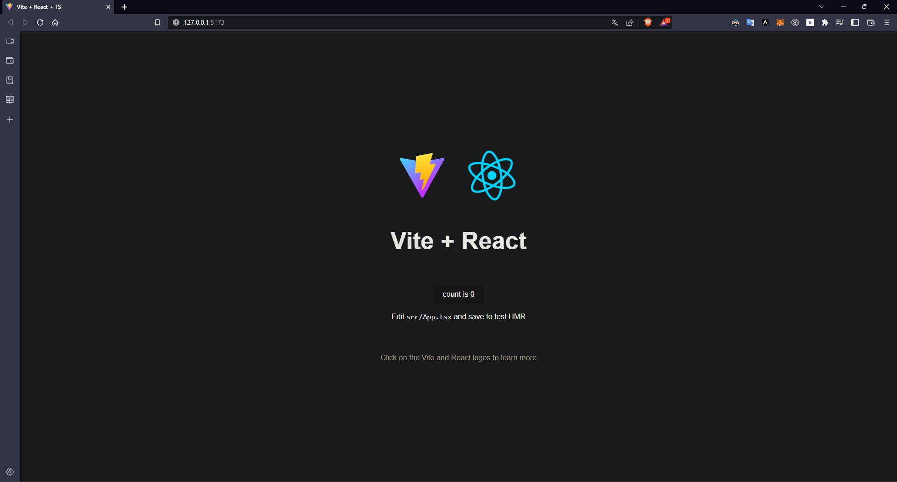

# Sección 02: ¿Por qué React Query?

## Inicio del proyecto - Número criptográfico aleatorio atmosférico

Vamos a crear un proyecto con [Vite](https://es.vitejs.dev/guide/), ejecutando el siguiente comando:

```txt
pnpm create vite
```

Le damos nombre al proyecto y seleccionamos el framework de React con la variante de TypeScript. Procedemos a instalar los paquetes de node_modules con el comando `pnpm install`. Una vez se hayan recreado los módulos, levantamos el proyecto con el siguiente comando:

```txt
pnpm dev
```

Si todo va bien, debemos poder ver la siguiente ventana en nuestro navegador:



## Número aleatorio criptográfico atmosférico

Vamos a usar el endpoint de [random.org](https://www.random.org/integers/?num=1&min=1&max=500&col=1&base=10&format=plain&rnd=new), para obtener un número aleatorio. Volvemos a nuestro proyecto y vamos a dejar inicialmente el archivo `App.tsx` de la siguiente manera:

```tsx
import './App.css'

const App = () => {
    return (
        <div className="App">

        </div>
    )
}

export default App
```

Lo primero será crear una función que haga la petición a la url y obtenga el número aleatorio:

```tsx
const getRandomNumber = async (): Promise<number> => {
    const res = await fetch( 'https://www.random.org/integers/?num=1&min=1&max=500&col=1&base=10&format=plain&rnd=new' )
    return Number( res.text() )
}
```

Dentro del componente usamos el hook de `useState` para crear un variable y modificar su estado, y además usamos el hook `useEffect` para renderizar el componente cada que ocurra un cambio en las dependencias que se le establezcan. Dentro de este último hook hacemos uso de la función que creamos, y seteamos la variable con el número aleatorio que se genera:

```tsx
const App = () => {
    const [ number, setNumber ] = useState<number>()

    useEffect( () => {
        getRandomNumber()
            .then( setNumber )
    }, [] )

    return (
        <div className="App">
            <h2>Random Number: { number }</h2>
        </div>
    )
}
```

Si observamos que el componente hace la petición 2 veces, se debe al modo estricto definido en el archivo `main.tsx`. No hay problema con que ocurra ese comportamiento, pero si no lo deseamos, simplemente eliminamos el tag de `React.StrictMode`, aunque no es tan recomendable.

```tsx
ReactDOM.createRoot( document.getElementById( 'root' ) as HTMLElement ).render(
    <React.StrictMode>
        <App />
    </React.StrictMode>
)
```

## Mejorar la experiencia de usuario

Nuestra aplicación tiene un pequeño detalle incómodo, y es en el momento en que está consultando el número random. En ese lapso, la aplicación no muestra ninguna información más allá del texto estático. Lo que haremos, será informarle al usuario que la aplicación está cargando, para ello creamos un estado de carga de tipo boolean, que inicia en true y una vez finaliza la petición pasa a false. Con dicho estado hacemos un conditional rendering para hacer la retroalimentación al usuario.

```tsx
const App = () => {
    const [ number, setNumber ] = useState<number>()
    const [ isLoading, setIsLoading ] = useState<boolean>( true )

    useEffect( () => {
        getRandomNumber()
            .then( setNumber )
            .finally( () => setIsLoading( false ) )
    }, [] )

    return (
        <div className="App">
            {
                isLoading
                    ? <h2>Loading...</h2>
                    : <h2>Random Number: { number }</h2>
            }
        </div>
    )
}
```

Otra característica que podemos implementar, es controlar los errores, así que hacemos algo similar a lo anterior, pero para mostrar de manera condicional un mensaje dependiendo del estado, creamos una función que muestre un elemento dependiendo del cumplimiento de las sentencias evaluadas:

```tsx
const App = () => {
    const [ number, setNumber ] = useState<number>()
    const [ error, setError ] = useState<string>()
    const [ isLoading, setIsLoading ] = useState<boolean>( true )

    useEffect( () => {
        getRandomNumber()
            .then( setNumber )
            .catch( e => setError( e.message ) )
            .finally( () => setIsLoading( false ) )
    }, [] )

    const conditionalRendering = () => {
        if ( isLoading ) return <h2>Loading...</h2>
        else if ( !isLoading && error ) return <h2>Oh no!!! An error occurred: <code>{ error }</code></h2>
        else return <h2>Random Number: { number }</h2>
    }

    return (
        <div className="App">
            { conditionalRendering() }
        </div>
    )
}
```

Podemos implementar un botón que vuelva a lanzar la petición de generar un número aleatorio, pero para ello vamos a usar el hook `useReducer`, del cual se puede desestructurar un state y una función dispatch para disparar la actualización del estado. Aprovechamos dicha variable como dependencia dentro del hook de `useEffect` en el que hacemos la petición, con la intención de que se haga fetch cada que cambia el estado de la dependencia. La actualización del estado del reducer se dispara cuando se presiona un botón.

En el hook de `useEffect` hacemos que primero se establezca como true el estado de `isLoading`, con el objetivo de que el usuario sepa que su petición se está procesando. Aprovechamos dicho estado para deshabilitar el botón mientras se hace el fetch.

```tsx
const App = () => {
    ...
    const [ dep, forceRefetch ] = useReducer( ( x ) => x + 1, 0 )

    useEffect( () => {
        setIsLoading( true )

        getRandomNumber()
            ...
    }, [ dep ] )

    return (
        <div className="App">
            {...}

            <button onClick={ forceRefetch } disabled={ isLoading }>Generate a new random number</button>
        </div>
    )
}
```

## TanStack - React Query - Instalación

Como vimos en la sección anterior, para hacer la consulta de un único número, la configuración de la petición es muy extensa. Lo que vamos a hacer es usar un manejador de estados asíncronos llamado [TanStack Query](https://tanstack.com/query/v4) (anteriormente conocido como React Query, pero debido a que se ha expandido a otros frameworks, decidieron cambiar su nombre). Para hacer su instalación usamos el siguiente comando:

```txt
pnpm i @tanstack/react-query
```

Para iniciar, dentro de nuestro proyecto vamos al archivo `main.tsx` y creamos un cliente de react-query y proveemos un contexto global de dicho cliente a toda la aplicación:

```tsx
...
import { QueryClient, QueryClientProvider } from '@tanstack/react-query'

const queryClient = new QueryClient()

ReactDOM.createRoot( document.getElementById( 'root' ) as HTMLElement ).render(
    <React.StrictMode>
        <QueryClientProvider client={ queryClient }>
            <App />
        </QueryClientProvider>
    </React.StrictMode>
)
```

## useQuery

Vamos a reemplazar nuestro archivo `App.tsx` por un nuevo código. Primero creamos la query con el hook de react query llamado `useQuery`, el cual recibe cómo parámetros la manera en que se manejara la cache, la función que carga los datos, y algunas opciones iniciales sobre la consulta. Para este caso, usamos la propiedad `isFetching` para saber si está haciendo la consulta al endpoint, `isError` para saber si tiene error, `isLoading` para saber si ya actualizó el cache, y `refetch()` para solicitar que se haga una nueva consulta.

```tsx
import { useQuery } from '@tanstack/react-query'
import './App.css'
import { getRandomNumber as fetcher } from './util/helpers/fetcher'


const App = () => {
    const query = useQuery( [ 'randomNumber' ], fetcher )

    return (
        <div className="App">
            <div className="App">
                {
                    (
                        () => {
                            if ( query.isFetching || query.isLoading ) return <h2>Loading...</h2>
                            else if ( !query.isLoading && !query.isFetching && query.isError )
                                return <h2>Oh no!!! An error occurred: <code>{ `${ query.error }` }</code></h2>
                            else return <h2>Random Number: { query.data }</h2>
                        }
                    )()
                }

                <button onClick={ () => query.refetch() } disabled={ query.isFetching }>Generate a new random number</button>
            </div>
        </div>
    )
}


export default App
```

Algo muy interesante de usar react query, es que, a pesar de estar usando el StrictMode en la aplicación, la consulta ejecuta solo una vez en cada petición, contrario a lo que pasaba con la solución anterior. Otro hecho interesante, es que siempre procura mantener actualizada la data a mostrar en el componente, claro, esto lo podemos desactivar desde las opciones de la instancia de la query.

Ahora bien, lo anterior funciona pero es mejor aplicar el patrón Adapter para evitar que si llega a cambiar la configuración del paquete de react-query, no nos afecte en gran medida nuestro proyecto, solo en una parte especifica del código. Esto lo logramos mediante un hook personalizado.

## Custom Hook - useRandom

La manera en que aplicamos el patrón Adapter, es extrayendo la consulta en un hook personalizado y usarlo en nuestro componente. Con esto centralizamos la lógica en una sola función, y evitamos que se rompa el código en caso de que ocurran cambios en el paquete original. Por el momento no vamos a desestructurar la constante de la consulta, puesto que podremos usar todas sus propiedad sin ningún problema, aunque esto va en contra del principio de Segregación de Interfaces.

```tsx
import { useQuery } from "@tanstack/react-query"
import { getRandomNumber as fetcher } from "../helpers/fetcher"


export const useRandom = () => {
    const query = useQuery( [ 'randomNumber' ], fetcher )

    return query
}
```

```tsx
...
import { useRandom } from './util/hooks/useRandom'

const App = () => {
    const query = useRandom()

    return (...)
}
```
